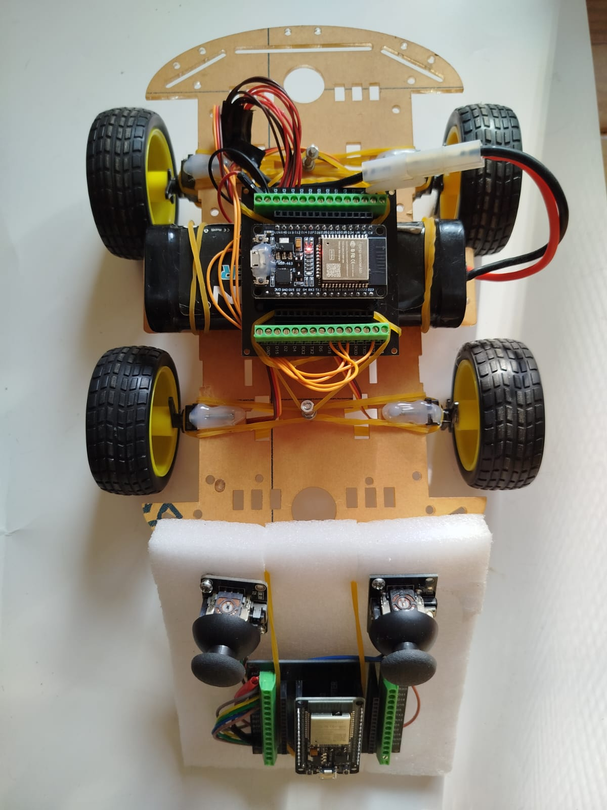
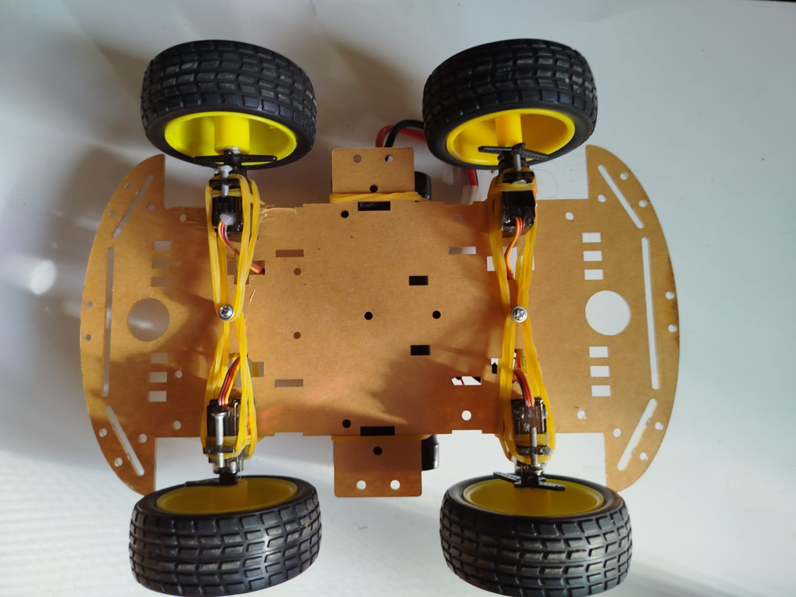
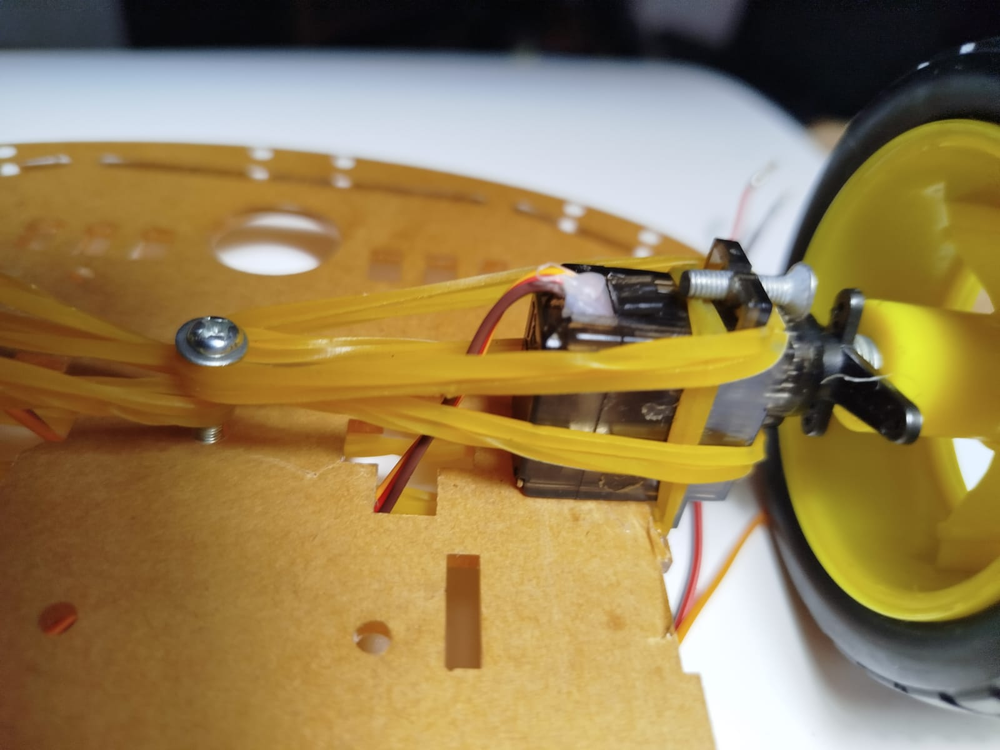
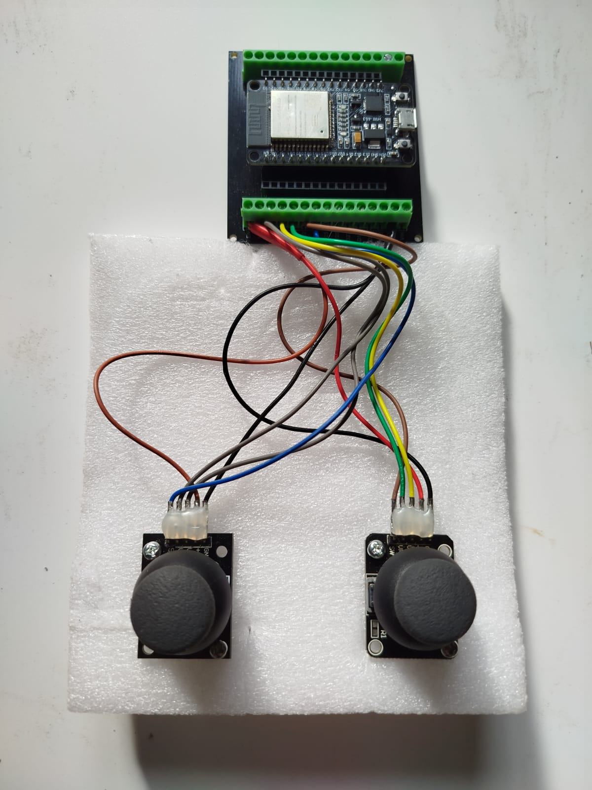

# Coche RC con ESP32 y Servomotores


<table>
  <tr>
    <td align="center" width="50%">
      Proyecto de un coche teledirigido de bajo coste controlado por ESP32. Se puede montar por menos de 10€ con componentes económicos.
    </td>
    <td align="center" width="50%">
      <div align="center">
        <a href="https://img.youtube.com/vi/tqV3hXHW25Q/hqdefault.jpg">
            
            <br>
            <strong>▶ Ver demostración</strong>
        </a>
      </div>
    </td>
  </tr>
</table>

## 🚗 Componentes del Coche

<table>
  <tr>
    <td align="center" width="33%">
      
      <br><em>Vista frontal del coche</em>
    </td>
    <td align="center" width="33%">
      
      <br><em>Vista superior</em>
    </td>
    <td align="center" width="33%">
      
      <br><em>Detalle servo</em>
    </td>
  </tr>
</table>

### Lista de materiales:
- 4 × Micro servomotor 360°
- 1 × Placa ESP32 Dev + base de expansión
- 1 × Batería 7.2V 3500mAh (TAMIYA o similar) ~4€
- 1 × Chasis básico
- 4 × Ruedas
- Tornillería
- Material de unión (gomas elásticas, pegamento)

## 🔌 Conexiones eléctricas

### Esquema de conexión de servomotores:

| Servo  | Alimentación (5V) | GND  | Señal (PWM) | Posición        |
|--------|------------------|------|-------------|-----------------|
| Servo 1| Fuente 5V        | GND  | GPIO 18     | Izquierda delante |
| Servo 2| Fuente 5V        | GND  | GPIO 19     | Derecha delante  |
| Servo 3| Fuente 5V        | GND  | GPIO 21     | Izquierda atrás  |
| Servo 4| Fuente 5V        | GND  | GPIO 22     | Derecha atrás    |

### Diagrama de alimentación:
```
Batería 7.2V
├── Rojo (+)  → VIN ESP32
├── Rojo (+)  → Servos (todos los cables rojos unidos)
├── Negro (-) → GND ESP32
└── Negro (-) → Servos (todos los cables negros unidos)
```
⚠️ **Importante:**
- La ESP32 no puede alimentar 4 servos directamente
- Usar siempre fuente externa de 5V
- Conectar GND de fuente externa al GND de la ESP32

## 🎮 Mando de control
Se ha montado el mando con 2 joystick pero para manejar el coche con 1 es suficiente.

 

### Componentes necesarios:
- 1 × Placa ESP32 Dev
- 1 × Batería 7.2V
- 1 × Mando de joystick analógico

Las conexiones detalladas del mando están disponibles en:  
[Repositorio de conexiones del joystick](https://github.com/portab76/ESP32/tree/main/joysticks/joy_calibration)

## ⚙️ Funcionamiento

El sistema usa comunicación ESP-NOW entre:
- **Emisor**: Mando con joystick
- **Receptor**: Coche con servomotores

## 🔄 Configuración de la comunicación ESP-NOW

Para que el mando envíe correctamente los datos al coche, es **imprescindible** configurar la dirección MAC del receptor:

1. Carga primero el programa `coche.ino` en la ESP32 del coche
2. Abre el Monitor Serie (115200 baudios)
3. Verás un mensaje como este:

```
SOY EL COCHE, MI MAC ADDRESS ES:
3C:8A:1F:08:8A:3C
```

4. En el archivo `mando.ino`, localiza esta sección:

```
// REPLACE CON LA MAC DEL COCHE
uint8_t broadcastAddress[] = {0x3C,0x8A,0x1F,0x08,0x8A,0x3C};
```
Reemplaza los valores {0x3C,0x8A,...} con la MAC que apareció en tu Monitor Serie, manteniendo el formato hexadecimal:
uint8_t broadcastAddress[] = {0xXX,0xXX,0xXX,0xXX,0xXX,0xXX}; 

⚠️ Importante:

Cada ESP32 tiene una MAC única

Si cambias la placa del coche, deberás actualizar esta dirección

La comunicación solo funcionará cuando ambas placas estén encendidas y emparejadas correctamente
