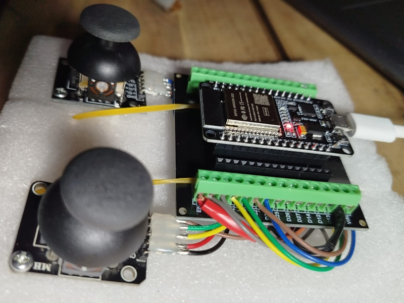
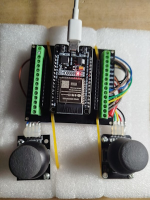

# Calibración Joysticks Analógicos con ESP32  

## 📌 Descripción  
Este programa permite leer y calibrar los valores obtenidos de **joysticks analógicos tipo PS2** conectados a una **placa ESP32 Dev Module**. 

## 🛠️ Materiales  
- **ESP32 DevKit V1** + Base de expansión  
- **2 Joysticks analógicos** (tipo PS2)  

  
  

## 🔌 Diagrama de Conexiones  
Cada joystick cuenta con 5 pines principales:  

| **Pin del Joystick 1** | **ESP32** | **Pin del Joystick 2** || **ESP32**
| **VCC** | 3.3V o 5V | **VCC** | 3.3V o 5V |
| **GND** | GND | **GND** | GND | GND |
| **VRX** | GPIO 34 | **VRX** | GPIO 36 |
| **VRY** | GPIO 35 | **VRY** | GPIO 39 |
| **SW** |  GPIO 32 | **SW** | GPIO 33 | 

> **Nota:** Los pines 34, 35, 36 y 39 del ESP32 son **de solo entrada (INPUT_ONLY)** y solo pueden leer señales analógicas.

## ⚙️ Funcionamiento  
1. Se leen las posiciones **X** e **Y** de ambos joysticks mediante los pines ADC.  
2. Se detectan las pulsaciones de los botones utilizando pines GPIO digitales.  
3. Se imprimen los valores obtenidos en el monitor serie para su análisis.  

## 🎯 Calibración de Joysticks  
### 📌 **Valores esperados**  
En teoría, las lecturas de `analogRead()` deben estar entre **0 y 2000**, y el punto de reposo debería ser **1000**.  

Sin embargo, en la práctica, estos valores varían. Ejemplo de lecturas en reposo:  

Joystick 1 - X: 937 | Y: 903 | SW: 1 Joystick 2 - X: 882 | Y: 939 | SW: 1
Joystick 1 - X: 930 | Y: 898 | SW: 1 Joystick 2 - X: 880 | Y: 942 | SW: 1
Joystick 1 - X: 933 | Y: 896 | SW: 1 Joystick 2 - X: 880 | Y: 942 | SW: 1
Joystick 1 - X: 928 | Y: 901 | SW: 1 Joystick 2 - X: 880 | Y: 940 | SW: 1

### 🔧 **Proceso de calibración**  
1. **Calibración del punto central**  
   - Se toman múltiples lecturas del joystick en reposo para calcular el **valor promedio** de cada eje.  
   - Este dato servirá como referencia para ajustar futuras mediciones.  

2. **Calibración de los ejes X e Y**  
   - Se solicita al usuario mover los joysticks a los extremos (izquierda/derecha para **X**, arriba/abajo para **Y**).  
   - Con estas mediciones, se calcula un **factor de escala** que normaliza las lecturas.  

3. **Filtrado y ajuste de valores**  
   - Los valores se ajustan a un rango de **-100 a 100**.  
   - Se implementa un filtro para eliminar pequeñas variaciones y mejorar la precisión.  

## 📡 Comunicación Inalámbrica con ESP-NOW  
El ESP32 cuenta con interfaces **Wi-Fi** y **Bluetooth**, lo que permite enviar los datos mediante **ESP-NOW**, un protocolo de comunicación de **Espressif Systems**.  

📌 **Guía para implementar ESP-NOW:**  
🔗 [ESP-NOW con ESP32 (Arduino IDE)](https://randomnerdtutorials.com/esp-now-esp32-arduino-ide/)  

## 📺 Mejoras Futuras  
✅ Añadir una **pantalla LCD** para mostrar los valores en tiempo real.  
✅ Implementar un **filtro digital** para suavizar las lecturas del joystick.  
✅ Enviar datos a otro ESP32 mediante **ESP-NOW** o **Bluetooth**.  

## 🔗 Recursos Adicionales  
📌 **Más información sobre el uso de joysticks con ESP32:**  
🔗 [Analog Joystick Interfacing with ESP32](https://www.electronicwings.com/esp32/analog-joystick-interfacing-with-esp32)  

🚀 **¡Listo para calibrar tus joysticks con ESP32!** 🎮