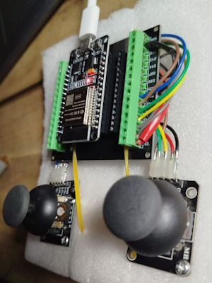

# Calibración Joysticks Analógicos con ESP32  

## 📌 Descripción  
Este programa permite leer y calibrar los valores obtenidos de **joysticks analógicos tipo PS2** conectados a una **placa ESP32 Dev Module**. 

## 🛠️ Materiales  
- **ESP32 DevKit V1** + Base de expansión  
- **2 Joysticks analógicos** (tipo PS2)  

<p align="center">
  
  
</p>

## 🔌 Diagrama de Conexiones  
Cada joystick cuenta con 5 pines principales:  

| **Pin del Joystick 1** | **ESP32** | **Pin del Joystick 2** | **ESP32** |
| ---------------------- | --------- | ---------------------- | --------- |
| **VCC** | 3.3V o 5V | **VCC** | 3.3V o 5V |
| **GND** | GND | **GND** | GND | GND |
| **VRX** | GPIO 34 | **VRX** | GPIO 36 |
| **VRY** | GPIO 35 | **VRY** | GPIO 39 |
| **SW** |  GPIO 32 | **SW** | GPIO 33 | 

## ⚙️ Funcionamiento  
1. Se leen las posiciones **X** e **Y** de ambos joysticks mediante los pines ADC.  
2. Se detectan las pulsaciones de los botones utilizando pines GPIO digitales.  
3. Se imprimen los valores obtenidos en el monitor serie para su análisis.  

## 🎯 Calibración de Joysticks  
### 📌 **Valores esperados**  
En teoría, las lecturas de `analogRead()` deben estar entre **0 y 2000**, y el punto de reposo debería ser **1000**.  

Sin embargo, en la práctica, estos valores varían. Ejemplo de lecturas en reposo:  
```
Joystick 1 - X: 937 | Y: 903 | SW: 1 Joystick 2 - X: 882 | Y: 939 | SW: 1
Joystick 1 - X: 930 | Y: 898 | SW: 1 Joystick 2 - X: 880 | Y: 942 | SW: 1
Joystick 1 - X: 933 | Y: 896 | SW: 1 Joystick 2 - X: 880 | Y: 942 | SW: 1
Joystick 1 - X: 928 | Y: 901 | SW: 1 Joystick 2 - X: 880 | Y: 940 | SW: 1
```
### 🔧 **Proceso de calibración**  

Determinamos en el codigo el rango de entrada de los valores que es obtienen en bruto de las lecturas analógicas:
```
// Rango esperado de los joysticks (ajusta según tus joysticks)
const int joy_min = 0;
const int joy_max = 2000;
```

1. **Calibración del punto central**  

- 1.1 Durante la calibración, se toman numLecturas (por ejemplo, 1000) lecturas de cada eje (X e Y) para ambos joysticks. Estas lecturas se suman en las variables:
```
sum_joy1_x: Suma de las lecturas del eje X del joystick derecho.
sum_joy1_y: Suma de las lecturas del eje Y del joystick derecho.
sum_joy2_x: Suma de las lecturas del eje X del joystick izquierdo.
sum_joy2_y: Suma de las lecturas del eje Y del joystick izquierdo.
```

- 1.2. Cálculo del valor promedio:
Una vez que se han tomado todas las lecturas, se calcula el valor promedio para cada eje dividiendo la suma total por el número de lecturas (numLecturas):
```
joy1_x_center = sum_joy1_x / numLecturas; // Valor central del eje X del joystick derecho
joy1_y_center = sum_joy1_y / numLecturas; // Valor central del eje Y del joystick derecho
joy2_x_center = sum_joy2_x / numLecturas; // Valor central del eje X del joystick izquierdo
joy2_y_center = sum_joy2_y / numLecturas; // Valor central del eje Y del joystick izquierdo
```

- 1.3. Uso del valor central:
Una vez calculados los valores centrales, se utilizan para ajustar las lecturas futuras. Por ejemplo, para el eje X del joystick derecho:
```
int valor_ajustado = analogRead(JOY1_X) - joy1_x_center;
```

Esto asegura que, cuando el joystick esté en reposo, el valor ajustado sea cercano a 0.

2. **Calibración de los ejes X e Y**  
   - Se solicita al usuario mover los joysticks a los extremos (izquierda/derecha para **X**, arriba/abajo para **Y**).  
   - Con estas mediciones, se calcula un **factor de escala** que normaliza las lecturas.  

- 2.1. Esperar a que las palancas estén en la posición deseada:
Para el eje Y (hacia arriba), se espera a que los valores de los ejes Y estén por debajo de -85.
Para el eje X (hacia la derecha), se espera a que los valores de los ejes X estén por debajo de -85.
Esto se hace para asegurar que las palancas están completamente en la posición deseada antes de comenzar la calibración.

```
while (true) {
  int joy1_y = ajustarValor(analogRead(JOY1_Y), joy1_y_center, joy_min, joy_max, output_min, output_max);
  int joy2_y = ajustarValor(analogRead(JOY2_Y), joy2_y_center, joy_min, joy_max, output_min, output_max);

  if (joy1_y < -85 && joy2_y < -85) {
    break; // Salir del bucle cuando ambos ejes Y estén por debajo de -85
  }

  delay(100); // Pequeño delay para no saturar el bucle
}
```

- 2.2. Tomar múltiples lecturas:
Se toman **numLecturas** (por ejemplo, 1000) lecturas de los ejes X o Y mientras las palancas están en la posición deseada.

Estas lecturas se suman en las variables **sum_joy1_y, sum_joy2_y, sum_joy1_x, o sum_joy2_x**.

```
long sum_joy1_y = 0, sum_joy2_y = 0;

for (int i = 0; i < numLecturas; i++) {
  sum_joy1_y += analogRead(JOY1_Y); // Sumar lecturas del eje Y del joystick derecho
  sum_joy2_y += analogRead(JOY2_Y); // Sumar lecturas del eje Y del joystick izquierdo

  // Mostrar el progreso cada 10%
  if ((i + 1) % (numLecturas / 10) == 0) {
    int progreso = ((i + 1) * 100) / numLecturas;
    Serial.print("Progreso: ");
    Serial.print(progreso);
    Serial.println("%");
  }

  delay(10); // Pequeño delay entre lecturas
}
```

- 2.3. Calcular el valor medio:
Se calcula el valor medio de las lecturas cuando las palancas están en la posición deseada.

```
int joy1_y_min = sum_joy1_y / numLecturas; // Valor medio del eje Y del joystick derecho
int joy2_y_min = sum_joy2_y / numLecturas; // Valor medio del eje Y del joystick izquierdo
```

- 2.4. Calcular el factor de escala:
El factor de escala se calcula para ajustar los valores medidos al valor deseado (-100 o 100).

```
joy1_y_scale = (float)output_min / ajustarValor(joy1_y_min, joy1_y_center, joy_min, joy_max, output_min, output_max);
joy2_y_scale = (float)output_min / ajustarValor(joy2_y_min, joy2_y_center, joy_min, joy_max, output_min, output_max);
```
Aquí, **output_min** es el valor deseado (-100), y **ajustarValor** convierte el valor medido al rango de salida.

- 2.5. Aplicar el factor de escala:
En las lecturas futuras, se multiplica el valor ajustado por el factor de escala para corregir la desviación.

```
int valor_escalado = (int)(valor_ajustado * escala);
```

3. **Filtrado y ajuste de valores**  
   - Los valores se ajustan a un rango de **-100 a 100**.  

```
// Rango deseado de salida
const int output_min = -100;
const int output_max = 100;
```

   - Se implementa un filtro para eliminar pequeñas variaciones y mejorar la precisión.  

🚀 **¡Listo para calibrar tus joysticks con ESP32!** 🎮